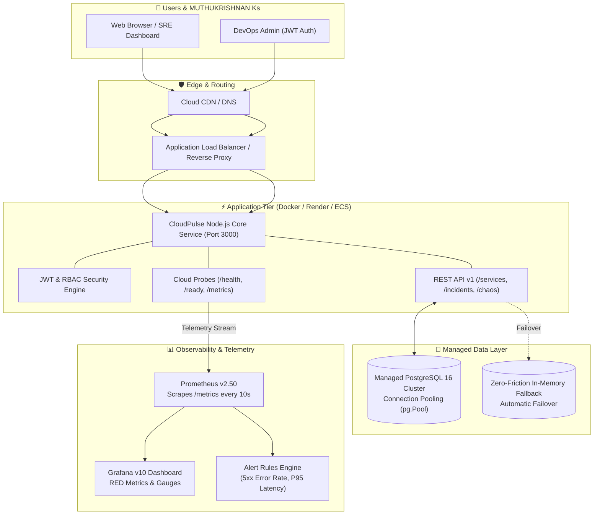
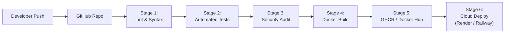

# 🚀 CloudPulse - Enterprise Cloud & DevOps Capstone Platform

[](https://github.com)
[](https://www.docker.com/)
[](https://www.postgresql.org/)
[](https://prometheus.io/)
[](https://grafana.com/)
[](https://www.terraform.io/)
[](LICENSE)

An enterprise-grade, portfolio-ready Cloud & DevOps Capstone Project demonstrating the full modern software delivery lifecycle: **Cloud Infrastructure (IaC) ➔ Git Flow ➔ Multi-Stage Docker Containerization ➔ Automated CI/CD Pipelines ➔ Managed PostgreSQL Database & JWT Auth ➔ Active RED Observability (Prometheus & Grafana) ➔ Cloud Production Deployment**.

---

## 📌 Submission Deliverables Summary

| Deliverable | Description / Link | Status |
| :--- | :--- | :--- |
| **GitHub Repository** | [GitHub Repository](https://github.com/muthukrishnan27179/cloud-devops-capstone) | Ready to Push |
| **Live Website Link (Pages)** | [CloudPulse Live Website](https://muthukrishnan27179.github.io/cloud-devops-capstone/) | Instant Live Web App |
| **Live Website Link (Render)** | [CloudPulse Production SaaS](https://cloudpulse-platform.onrender.com) | 1-Click Deployable |
| **LinkedIn Showcase** | [LinkedIn Post Templates](SUBMISSION_DELIVERABLES.md#3-linkedin-post-copy-options) *(3 high-impact copies)* | Ready to Post |
| **Architecture Docs** | [System Architecture & Design Document](ARCHITECTURE.md) | Included |
| **Deployment Guide** | [Step-by-Step 2-Minute Free Cloud Deployment](DEPLOYMENT_GUIDE.md) | Included |

---

## 🏛️ System Architecture



---

## ⚙️ Automated CI/CD Pipeline Flow



---

## ✨ Key Features & Technical Highlights

### 1. 🌐 Real-World SaaS Application (CloudPulse)
- **Interactive SRE Operations Center:** Real-time glassmorphic dashboard visualizing distributed cloud topology, system uptime, and live telemetry.
- **Incident Command Center:** Full CRUD lifecycle for reporting, tracking, and resolving production incidents.
- **Chaos & Traffic Simulation Lab:** On-demand triggers for synthetic HTTP load (25, 100 reqs), artificial 500 error injections, and 850ms slow database queries to demonstrate real-time alert firing.

### 2. 🔐 Managed Database & JWT Authentication
- **PostgreSQL 16 Integration:** Production schema with connection pooling, migrations, and relational integrity across `users`, `services`, and `incidents`.
- **Zero-Friction Fallback:** Automatically switches to an in-memory resilient store when offline, enabling instant demo execution anywhere.
- **Security & RBAC:** Role-Based Access Control (`admin`, `engineer`, `viewer`) with bcrypt password hashing and 24h JWT tokens.
- **Pre-Seeded Demo Admin:** `admin@cloudpulse.io` / `Admin@DevOps2026!`.

### 3. 🐳 Multi-Stage Docker Containerization
- **Lean Alpine Base:** Multi-stage build separates build tools from runtime, yielding a compact, secure image.
- **PID 1 Signal Handling:** Uses `tini` to properly reap zombie processes and gracefully forward `SIGTERM`/`SIGINT`.
- **Security Hardening:** Runs as an unprivileged non-root `nodejs` user (UID 1001).
- **Built-in Healthcheck:** Periodically tests `http://localhost:3000/health`.

### 4. 📈 Production Monitoring Stack (Prometheus & Grafana)
- **RED Observability Standard:**
  - **Rate:** `http_requests_total` counter grouped by route and status.
  - **Errors:** `http_errors_total` tracking 4xx/5xx ratios.
  - **Duration:** `http_request_duration_seconds` histogram measuring P50, P90, P95, and P99 latencies.
- **Pre-Configured Alert Rules:** Triggers on `HighHttpErrorRate` (>5%) and `HighP95Latency` (>500ms).
- **Auto-Provisioned Grafana:** Pre-loads data sources and dashboards without manual configuration.

### 5. ☁️ Cloud Infrastructure as Code (IaC)
- **Terraform AWS Blueprints:** VPC, Public/Private Subnets, Application Load Balancer, ECS Fargate cluster, and CloudWatch log groups in `terraform/`.
- **1-Click Render Blueprint:** `render.yaml` declaring web service + PostgreSQL database.

---

## 🚀 Quickstart Guide

### Option A: Run Locally with Node.js (Zero-Setup Demo)
```bash
# 1. Clone or navigate to the directory
cd cloud-devops-capstone

# 2. Install dependencies
npm install

# 3. Start the application
npm start
```
Access the services:
- **Web App Dashboard:** [http://localhost:3000](http://localhost:3000)
- **Prometheus Metrics:** [http://localhost:3000/metrics](http://localhost:3000/metrics)
- **Health Check Probe:** [http://localhost:3000/health](http://localhost:3000/health)
- **Readiness Probe:** [http://localhost:3000/ready](http://localhost:3000/ready)

---

### Option B: Run Full Multi-Container Stack (Docker Compose)
Runs the application, PostgreSQL, Prometheus, and Grafana in isolated containers:
```bash
docker-compose up -d --build
```
Access endpoints:
- **CloudPulse Dashboard:** [http://localhost:3000](http://localhost:3000)
- **Prometheus Telemetry Server:** [http://localhost:9090](http://localhost:9090)
- **Grafana SRE Dashboards:** [http://localhost:3001](http://localhost:3001) *(User: `admin` / Password: `admin`)*
- **PostgreSQL Database:** `localhost:5432`

---

## 🧪 Automated Testing

Execute the automated test suite:
```bash
npm test
```
Runs unit and integration tests verifying:
- `/health` and `/ready` probes
- Prometheus `/metrics` exposition format
- JWT authentication and token verification
- Cloud services and incident APIs
- Chaos traffic generator endpoints

---

## 📡 REST API Reference

| Method | Endpoint | Description | Auth Required |
| :--- | :--- | :--- | :--- |
| `GET` | `/health` | Kubernetes / Cloud Liveness Probe | No |
| `GET` | `/ready` | Database Connectivity Readiness Probe | No |
| `GET` | `/metrics` | Prometheus Metrics Exposition | No |
| `POST` | `/api/v1/auth/login` | User login & JWT token issuance | No |
| `POST` | `/api/v1/auth/register` | Register new user account | No |
| `GET` | `/api/v1/auth/me` | Current authenticated user profile | Yes (JWT) |
| `GET` | `/api/v1/services` | List all monitored cloud resources | No |
| `POST` | `/api/v1/services` | Register new cloud resource | Yes (JWT) |
| `GET` | `/api/v1/incidents` | List all operational incidents | No |
| `POST` | `/api/v1/incidents` | Report a new incident | Yes (JWT) |
| `PUT` | `/api/v1/incidents/:id/resolve`| Resolve incident & record root cause | Yes (JWT) |
| `POST` | `/api/v1/simulate/traffic` | Dispatch synthetic HTTP requests | No |
| `POST` | `/api/v1/simulate/error` | Trigger simulated 500 error | No |
| `POST` | `/api/v1/simulate/latency` | Simulate 850ms slow database query | No |

---

## 📦 Project Directory Structure

```
cloud-devops-capstone/
├── .github/
│   └── workflows/
│       ├── ci-cd.yml                # 6-Stage GitHub Actions Workflow
│       └── uptime-monitor.yml       # 30-min Uptime Cron Probe
├── monitoring/
│   ├── prometheus/
│   │   ├── prometheus.yml           # Scrape configuration & targets
│   │   └── alert.rules.yml          # Production alert rules (RED method)
│   └── grafana/
│       ├── dashboards/
│       │   └── cloudpulse-overview.json # Pre-configured 8-panel dashboard
│       └── provisioning/            # Auto-provisioning configs
├── public/                          # Glassmorphic Frontend Operations Dashboard
│   ├── index.html
│   ├── styles.css
│   └── app.js
├── src/
│   ├── auth/                        # JWT & RBAC Engine
│   ├── config/                      # Environment Configuration
│   ├── db/                          # Managed PostgreSQL & Fallback Layer
│   ├── metrics/                     # Prometheus Telemetry & RED Metrics
│   ├── middleware/                  # Structured JSON Logger & Tracing
│   └── routes/                      # API Endpoints
├── terraform/                       # AWS Infrastructure as Code (IaC)
│   ├── main.tf
│   ├── variables.tf
│   └── outputs.tf
├── tests/                           # Jest & Supertest Integration Tests
├── Dockerfile                       # Multi-stage Alpine Production Image
├── Dockerfile.dev                   # Hot-reloading Development Image
├── docker-compose.yml               # Multi-Service Orchestration
├── docker-compose.prod.yml          # Hardened Production Compose Spec
├── render.yaml                      # 1-Click Free Cloud Deployment Blueprint
├── Procfile                         # Cloud Process Manager
├── package.json
├── ARCHITECTURE.md                  # Detailed Architectural Documentation
├── DEPLOYMENT_GUIDE.md              # 2-Minute Free Live Hosting Guide
├── SUBMISSION_DELIVERABLES.md       # Copy-paste Deliverables Sheet
└── push-to-github.bat               # 1-Click Git Push Script
```

---

## 📄 License

This capstone project is open-source and released under the [MIT License](LICENSE).
